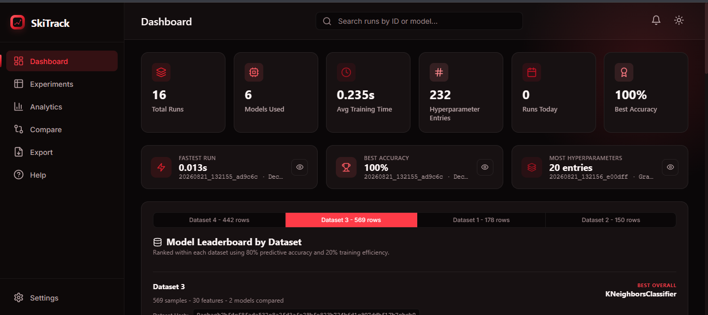

<div align="center">


# SkiTrack

### Local-First Experiment Tracking for Scikit-Learn

Track, compare, and browse your scikit-learn experiments with a single decorator — no external servers, no accounts, no cloud dashboard. Everything is stored locally on your machine.

[](LICENSE)
[](https://www.python.org/)
[](CHANGELOG.md)
[](#testing)

</div>

---

## Demo

<div align="center">



</div>

### Video Demo

https://github.com/user-attachments/assets/74f2aa73-bcf9-49ea-b9ae-a0a0694e7d69

---

## Problem Statement

When you're iterating on scikit-learn models, it's easy to lose track of what you already tried — which hyperparameters, which dataset, what accuracy you got, and when. Spreadsheets get messy fast, and full-blown experiment tracking platforms (MLflow, Weights & Biases, etc.) often mean setting up a server, an account, or sending your data somewhere else.

## Project Motivation

`skitrack` exists for the case where you just want to know "what did I already try, and how did it do?" without leaving your laptop. It's built for solo practitioners, students, and small projects that want lightweight, local experiment tracking — not a full MLOps platform.

## Key Features

- **One decorator** (`@track_run`) automatically logs your model, hyperparameters, dataset shape/hash, training time, and metrics.
- **100% local storage** — a SQLite database on disk, no network calls, no third-party services.
- **CLI** for listing, inspecting, deleting, and exporting runs (`tracker list`, `tracker show`, `tracker stats`, `tracker export`).
- **Built-in dashboard** — a local web UI (`tracker dashboard`) to browse and compare runs visually.
- **Dataset fingerprinting** — automatically hashes your dataset so you can tell which runs used the same data.
- **Cross-platform** — stores data in the correct OS-appropriate app-data folder on Windows, macOS, and Linux.

## Tech Stack

| Layer | Technology |
|---|---|
| Core tracking library | Python, scikit-learn, pandas, numpy |
| Storage | SQLite via SQLAlchemy |
| CLI | Click, Tabulate |
| Backend API | Flask, Flask-CORS |
| Dashboard frontend | React (Vite) |
| Testing | pytest, pytest-cov |

## System Architecture Overview

```
        ┌───────────────────────┐
        │  Your training code   │
        │   (@track_run)        │
        └──────────┬────────────┘
                   ↓
        ┌───────────────────────┐
        │  experiment_tracker   │
        │ (decorator + storage) │
        └──────────┬────────────┘
                   ↓
        ┌───────────────────────┐
        │   SQLite database     │
        │(local app-data folder)│
        └──────────┬────────────┘
                   ↓
        ┌──────────────────────┐
        │  Flask API (api.py)  │
        └──────────┬─────────────┘
                   ↓
        ┌──────────────────────┐
        │ React dashboard (UI) │
        └──────────────────────┘
```

See [docs/architecture.md](docs/architecture.md) for the full breakdown.

## Project Structure

```
skitrack/
├── experiment_tracker/     # Core package: decorator, storage, CLI, API
├── dashboard/              # React/Vite dashboard frontend
├── tests/                  # Test suite
├── examples/               # Example usage scripts
├── scripts/                # Helper/build scripts
├── docs/                   # Detailed documentation
├── setup.py
└── requirements.txt
```

## Requirements / Prerequisites

- Python 3.9+
- pip
- (Optional, for dashboard frontend development) Node.js + npm

## Installation

### From PyPI

Once published, install SkiTrack directly with:

```bash
pip install skitrack
```

This installs the `skitrack` package and registers the `tracker` CLI command. The published package includes the built dashboard assets, so Node.js and npm are **not required** for normal use.

### From Source

```bash
git clone https://github.com/Esha-Mirza/skitrack.git
cd skitrack
python -m venv venv
```

Activate the virtual environment:

```bash
# Windows
venv\Scripts\activate

# macOS / Linux
source venv/bin/activate
```

Then install the package:

```bash
python -m pip install --upgrade pip
python -m pip install -e .
```

See [docs/installation.md](docs/installation.md) for full details, including development setup.

## Environment-Variable Setup

`skitrack` works out of the box with no configuration. The optional `EXPERIMENT_TRACKER_DATA_DIR` environment variable can be used to customize where the local SQLite database is stored.

For example:

```bash
# macOS / Linux
export EXPERIMENT_TRACKER_DATA_DIR=/path/to/your/data

# Windows PowerShell
$env:EXPERIMENT_TRACKER_DATA_DIR="C:\path\to\your\data"
```

See [docs/configuration.md](docs/configuration.md) for all available settings.

## Configuration

By default, `skitrack` stores its SQLite database in your OS's standard local app-data folder. You can override this with the `EXPERIMENT_TRACKER_DATA_DIR` environment variable. Full details in [docs/configuration.md](docs/configuration.md).

## How to Run

```bash
tracker dashboard
```

This starts the local Flask server and opens the dashboard in your browser at `http://127.0.0.1:5000`.

## How to Use

Decorate any function that trains and returns a scikit-learn model:

```python
from experiment_tracker import track_run
from sklearn.datasets import load_iris
from sklearn.model_selection import train_test_split
from sklearn.ensemble import RandomForestClassifier

@track_run
def train_model():
    X, y = load_iris(return_X_y=True)
    X_train, X_test, y_train, y_test = train_test_split(X, y, test_size=0.2, random_state=42)

    model = RandomForestClassifier(n_estimators=100, max_depth=5, random_state=42)
    model.fit(X_train, y_train)

    return model, X_test, y_test

train_model()
```

That's it — the run is automatically logged. See [docs/usage.md](docs/usage.md) for the full workflow.

## Usage Examples

```bash
tracker list --verbose      # list recent experiments
tracker show <run_id>       # view details of a specific run
tracker stats                # summary statistics across all runs
tracker export --output experiments.csv
tracker dashboard --port 5050 --no-browser
```

## API Overview

The dashboard is powered by a small local Flask API (not meant for external/public use). See [docs/api.md](docs/api.md) for full endpoint documentation.

## Testing

```bash
pip install -r requirements-dev.txt
pytest
```

## Contribution Overview

Contributions are welcome! See [CONTRIBUTING.md](CONTRIBUTING.md) for the full workflow, branch naming, and commit conventions.

## Roadmap

See [ROADMAP.md](ROADMAP.md).

## Known Limitations

- Single-user, local-only — there is no multi-user or remote-access support.
- Dataset fingerprinting relies on hashing an in-memory representation, which can be slow on very large datasets.
- Currently scikit-learn only — no support yet for PyTorch, TensorFlow, or XGBoost-specific logging.
- The dashboard is intended for local use only; the Flask API has no authentication layer.

## License

MIT — see [LICENSE](LICENSE).

## Authors / Maintainers

- **Esha Mirza** — [GitHub](https://github.com/Esha-Mirza)

## Links

- [Issues](https://github.com/Esha-Mirza/skitrack/issues)
- [Discussions](https://github.com/Esha-Mirza/skitrack/discussions)
- [Documentation](docs/)
