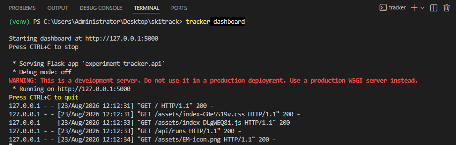

# Installation

## System Requirements

- Python **3.9 or newer**
- pip
- ~10 MB disk space for dependencies, plus space for your local experiment database (grows with usage)
- (Optional, only for dashboard frontend development) Node.js 18+ and npm

## Supported Platforms

`skitrack` is cross-platform and has been designed to work on:

- Windows
- macOS
- Linux

## Dependencies

Installed automatically via `pip`:

```
pandas>=2.0.0
numpy>=1.24.0
scikit-learn>=1.3.0
sqlalchemy>=2.0.0
click>=8.0.0
joblib>=1.3.0
python-dotenv>=1.0.0
tabulate>=0.9.0
flask>=2.0.0
flask-cors>=4.0.0
```

For development (testing), additionally:

```
pytest>=7.0.0
pytest-cov>=4.0.0
flask
```

## Installation Commands

### Standard install

```bash
git clone https://github.com/Esha-Mirza/Local-First-Experiment-Tracker-for-Scikit-Learn.git
cd Local-First-Experiment-Tracker-for-Scikit-Learn
pip install -e .
```

This installs the `experiment_tracker` package and registers the `tracker` CLI command.

### Development install

```bash
pip install -r requirements-dev.txt
pip install -e .
```

## Virtual Environment (recommended)

```bash
python -m venv venv

# Activate it:
source venv/bin/activate       # macOS / Linux
venv\Scripts\activate          # Windows

pip install -e .
```

## Database Setup

No manual database setup is required. `skitrack` automatically creates a local SQLite database (`experiments.db`) the first time it runs, in the OS-appropriate app-data folder (see [configuration.md](configuration.md) for exact paths, or to override the location).

## API Key Setup

None required. `skitrack` does not call any external API or service — everything runs locally.

## Environment Variables

Optional only. Copy `.env.example` to `.env` if you want to customize the data directory:

```bash
cp .env.example .env
```

See [configuration.md](configuration.md) for details.

## OS-Specific Notes

- **Windows**: the default data directory is `%LOCALAPPDATA%\experiment-tracker`.
- **macOS**: the default data directory is `~/Library/Application Support/experiment-tracker`.
- **Linux**: the default data directory is `$XDG_DATA_HOME/experiment-tracker`, falling back to `~/.local/share/experiment-tracker`.

## Verifying Installation

Run:

```bash
tracker stats
```

If installed correctly, you should see either experiment statistics (if you have prior runs) or:

```
No experiments to analyze
```

You can also start the dashboard to confirm the full stack works:

```bash
tracker dashboard
```



This should open `http://127.0.0.1:5000` in your browser automatically.
